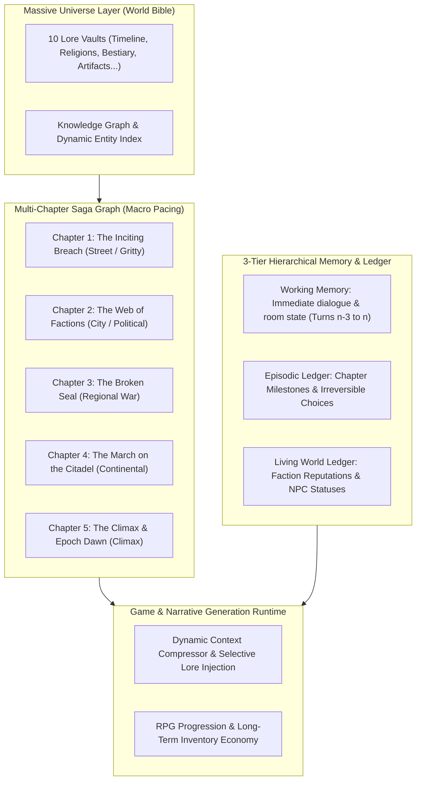

# Plan 07: Massive Universe Long-Form Saga & Episodic Campaign Engine

This architectural specification details AfsanehSaz's long-form campaign engine, designed to support massive world universes and 50–200+ turn interactive sagas across multiple interconnected chapters with zero context degradation.

---

## 🏛️ The 4 Pillars of the Long-Form Saga Engine

---

## 🚀 Key Systems to Build

### 1. Multi-Chapter Campaign Graph (`StoryChapter` & `SagaManifest`)
Move beyond a single flat 3-scene beat into an **Episodic Chapter Architecture**:
* **`StoryChapter`**:
  * `chapterNumber: number`
  * `title: string`
  * `scopeTier: 'street' | 'regional' | 'continental' | 'mythic'`
  * `narrativeGoal: string` (e.g. *"Infiltrate the Iron Guild and obtain the sealed ledger"*)
  * `prerequisiteFlags: string[]`
  * `scenes: StoryBeat[]` (5–8 scenes per chapter)
  * `completionSummaryPrompt: string`
* **Campaign Flowchart Canvas**: Zoom out to see the chapter progression line, and zoom in to edit individual chapter scenes.

---

### 2. Hierarchical 3-Tier Memory Engine (`MemoryEngine.ts` v2)
Prevent AI context window exhaustion and forgotten storylines across 100+ turns:
1. **Tier 1 (Working Memory)**: Verbatim text of the last 3 turns and active scene choices.
2. **Tier 2 (Episodic Milestone Rollup)**: Compressed chronological summary of completed chapters:
   * *Example*: `"In Chapter 1, the protagonist chose to poison Commander Vael, befriended the Smuggler Guild, and lost the family heirloom."*
3. **Tier 3 (Living World State Ledger)**:
   * **Faction Reputations**: `Syndicate: +25 (Allied)`, `Holy Order: -60 (Hostile)`
   * **NPC Life Status**: `Vael: Dead`, `Donald: Imprisoned`, `Lyra: Traveling Companion`
   * **Key Clues & Artifacts Held**: Items with lasting story flags.

---

### 3. Multi-Arc Saga Synthesizer (`/api/studio/generate`)
* **"👑 Synthesize Full 5-Chapter Epic Saga"**:
  * Reads the entire World Bible (Laws, Factions, Relics, Bestiary, Religions, Timeline).
  * Automatically scaffolds a 5-Chapter episodic arc with escalating narrative scope, faction conflicts, and dramatic branching checkpoints.
  * Ensures that early chapters stay strictly grounded (threat level 1–2) before expanding to kingdom-level or mythic stakes.

---

### 4. Dynamic Context-Aware Lore Retrieval
Instead of stuffing the entire World Bible into every turn:
* The engine uses the **Active Chapter Scope** and **Scene Location/NPCs** to inject *only* the relevant 5–10% of world lore required for the current situation.
* Dramatically reduces token usage, speeds up response times, and keeps the AI laser-focused on immediate literary quality.

---

## 📁 Implementation Roadmap

| Phase | Component | Key Files | Description |
| :--- | :--- | :--- | :--- |
| **Phase 1** | **Types & Zod Schemas** | `web/src/lib/types/world.ts`, `web/src/lib/types/index.ts` | Add `StoryChapter`, `SagaManifest`, `WorldStateLedger` schemas |
| **Phase 2** | **Memory & Ledger Engine** | `web/src/lib/engines/memory/MemoryEngine.ts`, `web/src/lib/engines/narrative/worldContext.ts` | Build 3-tier hierarchical memory rollups and dynamic context pruning |
| **Phase 3** | **Saga Generator API** | `web/src/app/api/studio/generate/route.ts` | Add `type: 'epic_saga_synthesis'` generator with chapter-by-chapter pacing |
| **Phase 4** | **Campaign Studio Canvas** | `web/src/app/studio/beats/page.tsx`, `web/src/components/studio/StoryTreeCanvas.tsx` | Multi-chapter campaign view with chapter tabs and zoomable tree |
| **Phase 5** | **Tests & Verification** | Unit test suites | Test long-horizon context rollup, saga synthesis, and state persistence |
